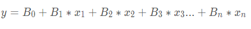

- What machine learning is and why it's so important in today's world
- The historical context of machine learning
- The data science process
- The types of data that machine learning deals with
- The two main perspectives in ML: the statistical perspective and the computer science perspective
- The essential tools needed for designing and training machine learning models
- basics of Azure ML
- Distinction between models and algorithms
- The basics of linear regression model
- distinction between parametric vs non-parametric functions
- the distinction between classical machine learning vs deep learning
- the main approaches to machine learning
- the trade-offs that come up when making decisions about how to design and train machine learning models.

## What is Machine Learning

> Machine learning is a data science technique used to extract patterns from data, allowing computers to identify related data, and forecast future outcomes, behaviours and trends.

## Applications of Machine Learning

The applications of machine learning are extremely broad! And the opportunities cut across industry verticals. Whether the industry is healthcare, finance, manufacturing, retail, government or education.
A few examples include:-

- Automate the recognition of disease
- Recommend next best actions for individual care plans
- Enable personalized, real-time banking experience with chatbots
- Identify the next best action for the customer
- capture, prioritize, and route service requests to the correct employee and improve response times.

## The Data Science Process

Big data has become part of the lexicon of organizations worldwide, as more and more organizations look to leverage data to drive informed business decisions. With this evolution in business decision-making, the amount of raw data collected, along with the number and diversity of data sources is growing at an astounding rate. This data presents enormous potential.

Raw data, however is often noisy and unreliable and may contain missing values and outliers. Using such data for modelling can produce misleading results. For the data scientist, the ability to combine large, disparate data sets into a format more appropriate for analysis is an increasingly crucial skill.

The data science process typically starts with collecting and preparing the data before moving on to training, evaluating and deploying a model.

Collect Data -> Prepare Data -> Train Model -> Evaluate Model -> Deploy Model

## The Types of Data

- Numerical
- Time-Series
- Categorical
- Text
- Image

### Tabular Data

In machine learning, the most common type of data you'll encounter is tabular data - that is, data that is arranged in a data table.

It is important to know that in machine learning, we ultimately always work with numbers or specifically _vectors_.

> A vector is simply an array of numbers, such as `(1,2,3)` - or a nested array that contains other arrays of numbers such as `(1,2,(1,2,3))`

Vectors are used heavily in machine learning.

## Scaling Data

Scaling data means transforming it so that the values fit within some range or scale, such as 0-100 or 0-1. There are a number of reasons why it is a good idea to scale your data before feeding it into a machine learning algorithm.

Two common approaches to scaling data includes **standardization** and **normalization**

### Standardization

> **Standardization** rescales data so that it has a mean of 0 and a standard deviation of 1.

The formula for this is

> (𝑥 − 𝜇)/𝜎

### Normalization

> Normalization rescales the data into the range [0,1]

The formula for this is

> (𝑥 −𝑥𝑚𝑖𝑛)/(𝑥𝑚𝑎𝑥 −𝑥𝑚𝑖𝑛)

## Encoding Categorical Data

There are two common approaches for encoding categorical data: **ordinal encoding** and **one hot encoding**.

### Ordinal Encoding.

In ordinal encoding, we simply convert the categorical data into integer codes ranging from `0` to `(number of categories -1)`. One of the potential drawbacks to this approach is that it implicitly assumes order across the categories.

### One-Got Encoding

**One-hot encoding** is a very different approach. In one-got encoding, we transform each categorical value into a column. If there are n categorical values, n new columns are added. If an item belongs to a category, the column representing that category gets the value `1` and all other columns get the value `0`. One drawback of one-hot encoding is that it can potentially generate a very large number of columns.

## Image Data

The color or each pixel is represented with a set of values:

- In **grayscale images**, each pixel can be represented by a **single** number, which typically ranges from 0 to 255.
- In **colored images**, each pixel can be represented by a vector of three numbers (each ranging from 0 to 255) for the three primary color channels: red, green, and blue.

### Encoding an Image

We need to know the following three things about an image to reproduce it:

- Horizontal position of each pixel
- Vertical position of each pixel
- Color of each pixel

Thus, we can fully encode an image numerically by using a vector with three dimensions. The size of the vector required for any given image would be the `height * width * depth` of that image.

### Other Preprocessing Steps

In addition to encoding an image numerically, we may also need to do some other preprocessing steps. Generally, we would want to ensure that the input images have a _uniform aspect ratio_ (e.g. by making sure all of the input images are square in shape) and are normalizes (e.g subtract mean pixel value in a channel from each pixel value in that channel). Some other preprocessing operations we might want to do to clean the input images include rotation, cropping, resizing, denoising and centering the image.

## Text Data

Text is another example of a data type that is initially non-numerical and that must be processed before it can be fed into a machine learning algorithm. Common tasks that we might do as part of this processing include:

### Normalization

One of the challenges that can come up in text analysis is that there are often multiple forms that mean the same thing. Text normalization is the process of transforming a piece of text into a canonical(official) form.

_Lemmatization_ is an example of normalization. A lemma is the dictionary form of a word and lemmatization is the process of reducing multiple inflections to that single dictionary form.

In many cases, you may also want to remove _stop words_. Stop words are high-frequency words that are unnecessary(or unwanted) during the analysis.

Tokenized the text (i.e., split each string of text into a list of smaller parts or tokens), removed stop words (`the`) and standardized spelling

### Vectorization

After we have normalized the text, we can take the next step of actually encoding it in a numerical form. The goal here is to identify the particular features of the text that will be relevant to us for the particular task we want to perform- and then get those features extracted in a numerical form that is accessible to the machine learning algorithm. ypically this is done by text vectorization—that is, by turning a piece of text into a vector. Remember, a vector is simply an array of numbers—so there are many different ways that we can vectorize a word or a sentence, depending on how we want to use it. Common approaches include:

- Term Frequency-Inverse Document Frequency (TF-IDF) vectorization
- Word embedding, as done with Word2vec or Global Vectors (GloVe)

## The Tools for Machine Learning

A typical machine learning ecosystem is made up of three main components:

- **Libraries** - A library is a collection of pre-written(and compiled) code that you can make use of in your own project.
- **Development environments** - A _development environment_ is a software application(or sometimes a group of applications) that provide a whole suite of tools designed to help you(as the developer or machine learning engineer) build out your projects.
- **Cloud services**

### Core Framework and Tools

- **Python** - is a very popular high-level programming language that is great for data science. Its ease of use and wide support within popular machine learning platforms, coupled with a large catalog of ML libraries, has made it a leader in this space.
- **Pandas** - is an open-source Python library designed for analyzing and manipulating data. It is particularly good for working with tabular data and time-series data.
- **Numpy** - like Pandas, is a Python library. NumPy provides support for large, multi-dimensional arrays of data, and has many high-level mathematical functions that can be used to perform operations on these arrays.

### Machine Learning and Deep Learning

- **Scikit-Learn** - is a Python library designed specifically for machine learning. It is designed to be integrated with other scientific and data-analysis libraries, such as NumPy, SciPy, and matplotlib
- **Apache Spark** - is an open-source analytics engine that is designed for cluster-computing and that is often used for large-scale data processing and big data.
- **TensorFlow** - is a free, open-source software library for machine learning built by Google Brain.
- **Keras** - is a Python deep-learning library. It provide an Application Programming Interface (API) that can be used to interface with other libraries, such as TensorFlow, in order to program neural networks. Keras is designed for rapid development and experimentation.
- **Pytorch** - is an open source library for machine learning, developed in large part by Facebook's AI Research lab. It is known for being comparatively easy to use, especially for developers already familiar with Python and a Pythonic code style.

### Data Visualization

- **Plotly** - is not itself a library, but rather a company that provides a number of different front-end tools for machine learning and data science—including an open source graphing library for Python.
- **Matplotlib** - is a Python library designed for plotting 2D visualizations. It can be used to produce graphs and other figures that are high quality and usable in professional publications. You'll see that the Matplotlib library is used by a number of other libraries and tools, such as SciKit Learn (above) and Seaborn (below). You can easily import Matplotlib for use in a Python script or to create visualizations within a Jupyter Notebook.
- **Seaborn** - is a Python library designed specifically for data visualization. It is based on matplotlib, but provides a more high-level interface and has additional features for making visualizations more attractive and informative.
- **Bokeh** - is an interactive data visualization library. In contrast to a library like matplotlib that generates a static image as its output, Bokeh generates visualizations in HTML and JavaScript. This allows for web-based visualizations that can have interactive features.

## Cloud Services for Machine Learning

A typical cloud service for machine learning provides support for managing the core assets involved in machine learning projects.

- **Datasets** - Define, version, and monitor datasets used in machine learning runs.
- **Experiments/Runs** - Organize machine learning workloads and keep track of each task executed through the service.
- **Pipelines** - Structured flows of tasks to model complex machine learning flows.
- **Models** - Model registry with support for versioning and deployment to production.
- **Endpoints** - Expose real-time endpoints for scoring as well as pipelines for advanced automation.

Machine learning cloud services also need to provide support for managing the resources required for running machine learning tasks.

- **Compute** - Manage compute resources used by machine learning tasks.
- **Environments** - Templates for standardized environments used to create compute resources.
- **Datastores** - Data sources connected to the service environment (e.g. blob stores, file shares, Data Lake stores, databases).

## Models vs Algorithms

- **Models** are the specific representations learned from data
- **Algorithms** are the processes of learning

Machine learning models are outputs or specific representations of algorithms that run on data. A model represents what is learned by a machine learning algorithm on the data.

## The Linear Regression Algorithm

Linear regression is an algorithm that uses a straight line (or plane) to describe relationships between variables.

### Preparing the data

- Linear assumption
- Remove noise
- Remove collinearity - When two variables are collinear, this means they can be modeled by the same line or are at least highly correlated. Having highly correlated input variables will make the model less consistent, so it's important to perform a correlation check among input variables and remove highly correlated input variables.
- Gaussian distributions
- Rescale inputs

### Multiple Linear Regression

In more complex cases where there is more than one input variable, we might see something like this:



When we have multiple input variables like this, we call it multiple linear regression. The visualization of multiple linear regression is no longer a simple line but instead a plane in multiple dimensions.

To "train a linear regression model" simply means to learn the coefficients and bias that best fits the data.

The process of finding the best model is essentially a process of finding the coefficients and bias that minimize this error. To calculate this error, we use a cost function. There are many cost functions you can choose from to train a model and resulting error will be different depending on which cost function you choose. The most commonly used cost function for linear regression is the **root mean squared error (RMSE)**

### Azure Machine Learning designer(preview)

Gives you a cloud-based interactive visual workspace that you can use to easily and quickly prep data, train and deploy machine learning models. It supports Azure Machine Learning compute, GPU or CPU. Machine Learning designer also supports publishing models as web services on Azure Kubernetes Service that can easily be consumed by other applications.

## Learning a Function

We can generally think of a machine learning algorithm as a process for learning and models as specific representations that we train using data. In essence, machine learning algorithms aim to learn a target function(f) that describes the mapping between data input variables and an output variable (Y).

The core goal is to lean a useful transformation of the input data that gets us closer to the expected output.

Since the process extrapolates from a limited set of values, there will always be an error _e_ which is independent of the input data (X) such that

```
Y = f(X) + e
```

The variable `e` is called irreducible error because no matter how good we get at estimating the target function(f), we cannot reduce this error.

Note that the irreducible error is different from the model error. Irreducible error is caused by the data collection process - such as when we don't have enough data or don't have enough data features. In contrast, the model error measures how much the prediction made by the model is different from the true output. The model error is generated from the model and can be reduced during the model learning process.

## Parametric vs Non-parametric

Based on the assumptions about the shape and structure of the function they try to learn, machine learning algorithms can be divided into two categories: parametric and nonparametric.

### Parametric Machine Learning Algorithms

Parametric machine learning algorithms make assumptions about the mapping function and have a fixed number of parameters. No matter how much data is used to learn the model, this will not change how many parameters the algorithm has. With a parametric algorithm, we are selecting the form of the function and then learning its coefficients using the training data.

An example of this would be the approach used in linear regression algorithms, where the simplified functional form can be something like:

> B*0 + B_1 * X*1 + B_2 * X_2 = 0

This assumption greatly simplifies the learning process; after selecting the initial function, the remaining problem is simply to estimate the coefficients B0, B1, and B2 using different samples of input variables X1 and X2.

**Benefits**:

- Simpler and easier to understand; easier to interpret the results
- Faster when talking about learning from data
- Less training data required to learn the mapping function, working well even if the fit to data is not perfect

**Limitations**:

- Highly constrained to the specified form of the simplified function
- Limited complexity of the problems they are suitable for
- Poor fit in practice, unlikely to match the underlying mapping function.

### Non-parametric Machine Learning Algorithms

Non-parametric algorithms do not make assumptions regarding the form of the mapping function between input data and output. Consequently, they are free to learn any functional form from the training data.

**Benefits**:

- High flexibility, in the sense that they are capable of fitting a large number of functional forms
- Power by making weak or no assumptions on the underlying function
- High performance in the prediction models that are produced

**Limitations**:

- More training data is required to estimate the mapping function
- Slower to train, generally having far more parameters to train
- Overfitting the training data is a risk; overfitting makes it harder to explain the resulting predictions

## Classical ML vs. Deep Learning

Deep learning algorithms are based on neural networks and the classical ML algorithms are based on classical mathematical algorithms, such as linear regression, logistic regression, decision tree, SVM and so on.

**Deep Learning advantages**

- Suitable for high complexity problems
- Better accuracy, compared to classical ML
- Better support for big data
- Complex features can be learned

**Deep Learning disadvantages**

- Difficult to explain trained data
- Require significant computational power

**Classical ML advantages**

- More suitable for small data
- Easier to interpret outcomes
- Cheaper to perform
- Can run on low-end machines
- Does not require large computational power

**Classical ML disadvantages**

- Difficult to learn large datasets
- Require feature engineering
- Difficult to learn complex functions

## Approaches to Machine Learning

There are three main approaches to machine learning:

Supervised learning
Unsupervised learning
Reinforcement learning

### Supervised learning

Learns from data that contains both the inputs and expected outputs (e.g., labeled data). Common types are:

- **Classification**: Outputs are categorical.
- **Regression**: Outputs are continuous and numerical.
- **Similarity learning**: Learns from examples using a similarity function that measures how similar two objects are.
- **Feature learning**: Learns to automatically discover the representations or features from raw data.
- **Anomaly detection**: A special form of classification, which learns from data labeled as normal/abnormal.

### Unsupervised learning

Learns from input data only; finds hidden structure in input data.

- **Clustering**: Assigns entities to clusters or groups.
- **Feature learning**: Features are learned from unlabeled data.
- **Anomaly detection**: Learns from unlabeled data, using the assumption that the majority of entities are normal.

### Reinforcement learning

Learns how an agent should take action in an environment in order to maximize a reward function.

- **Markov decision process**: A mathematical process to model decision-making in situations where outcomes are partly random and partly under the control of a decision-maker. Does not assume knowledge of an exact mathematical model.
  The main difference between reinforcement learning and other machine learning approaches is that reinforcement learning is an active process where the actions of the agent influence the data observed in the future, hence influencing its own potential future states. In contrast, supervised and unsupervised learning approaches are passive processes where learning is performed without any actions that could influence the data.

## The Trade-Offs

Machine learning involves certain trade-offs. Two of the most important are **bias vs variance** and **overfitting vs. underfitting**.

### Bias Vs. Variance

**Bias** measures how inaccurate the model prediction is in comparison with the true output. It is due to erroneous assumptions made in the machine learning process to simplify the model and make the target function easier to learn. High model complexity tends to have a low bias.

**Variance** measures how much the target function will change if different training data is used. Variance can be caused by modeling the random noise in the training data. High model complexity tends to have a high variance.

As a general trend, parametric and linear algorithms often have high bias and low variance, whereas non-parametric and non-linear algorithms often have low bias and high variance

### Overfitting vs. Underfitting

Overfitting refers to the situation in which models fit the training data very well, but fail to generalize to new data.

Underfitting refers to the situation in which models neither fit the training data nor generalize to new data.

### Bias vs. Variance Trade-off

The prediction error can be viewed as the sum of model error (error coming from the model) and the irreducible error (coming from data collection).

```
prediction error = Bias error + variance + error + irreducible error
```

Low bias means fewer assumptions about the target function. Some examples of algorithms with low bias are KNN and decision trees. Having fewer assumptions can help generalize relevant relations between features and target outputs. In contrast, high bias means more assumptions about the target function. Linear regression would be a good example (e.g., it assumes a linear relationship). Having more assumptions can potentially miss important relations between features and outputs and cause underfitting.

Low variance indicates changes in training data would result in similar target functions. For example, linear regression usually has a low variance. High variance indicates changes in training data would result in very different target functions. For example, support vector machines usually have a high variance. High variance suggests that the algorithm learns the random noise instead of the output and causes overfitting.

Generally, increasing model complexity would decrease bias error since the model has more capacity to learn from the training data. But the variance error would increase if the model complexity increases, as the model may begin to learn from noise in the training data.

The goal of training machine learning models is to achieve low bias and low variance. The optimal model complexity is where bias error crosses with variance error.

### Overfitting vs. Underfitting

- k-fold cross-validation: it split the initial training data into k subsets and train the model k times. In each training, it uses one subset as the testing data and the rest as training data.
- hold back a validation dataset from the initial training data to estimatete how well the model generalizes on new data.
- simplify the model. For example, using fewer layers or less neurons to make the neural network smaller.
- use more data.
- reduce dimensionality in training data such as PCA: it projects training data into a smaller dimension to decrease the model complexity.
- Stop the training early when the performance on the testing dataset has not improved after a number of training iterations.

# Model Training

Before training a model, we first need to handle data preparation, specifically

- Data importing and transformation
- The data management process, including: - The use of datastores and datasets - versioning - feature engineering - How to monitor for data drift
  Model training
- The core model training process
- Two of the fundamental machine learning models: Classifier and regressor
- The model evaluation process and relevant metrics

ensemble learning and automated machine learning.

## Data wrangling

Data wrangling is the process of cleaning and transforming data to make it more appropriate for data analysis. The process generally follows these main steps:

- Explore the raw data and check the general quality of the dataset.
- Transform the raw data, by restructuring, normalizing, and cleaning the data. For example, this could involve handling missing values and detecting errors.
- Validate and publish the data

Data wrangling is an iterative process where you do some data transformation then check the results and come back to the process to make improvements.

## Managing Data

Azure Machine Learning has two data management tools that we need to consider: Datastores and datasets.

- **Datastores** offers a layer of abstraction over the supported Azure storage services. They store all the information needed to connect to a particular storage service. Datastores provide an access mechanism that is independent of the computer resource that is used to drive a machine learning process.
- **Datasets** are resources for exploring, transforming, and managing data in Azure ML. A dataset is essentially a reference that points to the data in storage. It is used to get specific data files in the datastores.

### The Data Access Workflow

The steps of the data access workflow are:

1.  **Create a datastore** so that you can access storage services in Azure
2.  **Create a dataset**, which you will subsequently use for model training in your machine learning experiment.
3.  **Create a dataset monitor** to detect issues in the data, such as data drift

Over time, the input data that you are feeding into your model is likely to change- and this is what is meant by data drift. You can set up dataset monitors to detect data drift and other issues in your data. When data drift is detected, you can have the system automatically update the input dataset so that you can retain the model and maintain its accuracy.

### Key points about datasets

- They are used to interact with your data in the datastore and to package data into consumable objects.
- They can be created from local files, public URLs, Azure Open Datasets, and files uploaded to the datastores
- They are not copies of the data but references that point to the original data. This means that no extra storage cost is incurred when you create a new dataset.
- Once a dataset is registered in Azure ML workspace, you can share it and reuse it across various other experiments without data ingestion complexities.

You may want to version your data when:

- New data is available for retraining
- When you are applying different approaches to data preparation or feature engineering.

Keep in mind that there are two dataset types supported in Azure ML Workspace:

- The **Tabular Dataset**, which represents data in a tabular format created by parsing the provided file or list of files.
- The **Web URL(File Dataset)**, which references single or multiple files in datastores or from public URLs

### Introducing Features

Columns in a table can be referred to as **features**. Feature engineering is an important part of data preparation. In many cases, the set of initial features in the data is not enough to produce high quality trained machine learning models. You can use **feature engineering** to derive new features based on the values of existing features. This process can be as simple as applying a mathematical function to a feature or it can be as complex as training a separate machine leaning model to create values for new features.

Once you have the features, another important task is selecting the features that are most important or most relevant. This process is called **feature selection**.

Many machine learning algorithms cannot accommodate a large number of features, so it is often necessary to do **dimensionality reduction** to decrease the number of features.

Classical ML is much more reliant on Feature Engineering than Deep Learning. Deep Learning can be used for implementation of certain Feature Engineering processes like embedding.

#### Common Feature Engineering Tasks

- Aggregation - sum, mean, average
- Part-of
- Binning
- Flagging
- Frequency-based
- Embedding (Feature Learning)
- Deriving by example

#### Summary of feature engineering approaches by data type

Some of the most widely used types of data used in Machine Learning are numbers, text, and image.

- Numerical data comes usually in tabular format and is subject to "classical" feature engineering tasks
- Text is, by nature, not really suitable for numerical processing - needs to be translated.
- Image has the same problem, RGB(or other equivalent) needs to be translated.

### Feature Selection

There are mainly two reasons for feature selection. Some features might be highly irrelevant or redundant. So it's better to remove these features to simplify the sitution and improve performance. Additionally, it may seem like engineering more features is always a good thing, but as we mentioned earlier, many machine learning algorithms suffer from the curse of dimensionality—that is, they do not perform well when given a large number of variables or features.

We can improve the situation of having too many features through dimensionality reduction.

Commonly used techniques are:

- PCA (Principal Component Analysis)
- t-SNE(t-Distributed Stochastic Neighboring Entities)
- Feature embedding

Azure ML prebuilt modules:

- Filter-based features selection: identify columns in the input dataset that have the greatest predictive power
- Permutation feature importance: determined the best features to use by computing the feature importance scores
